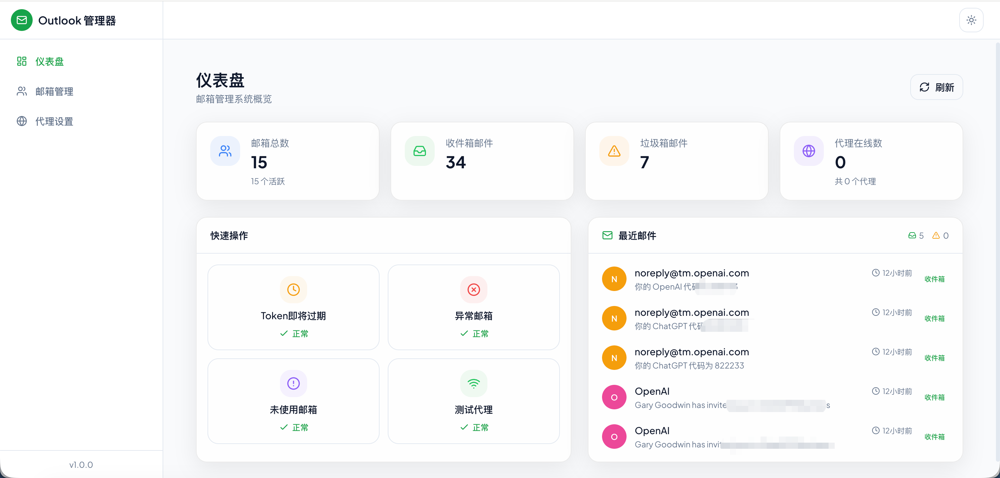
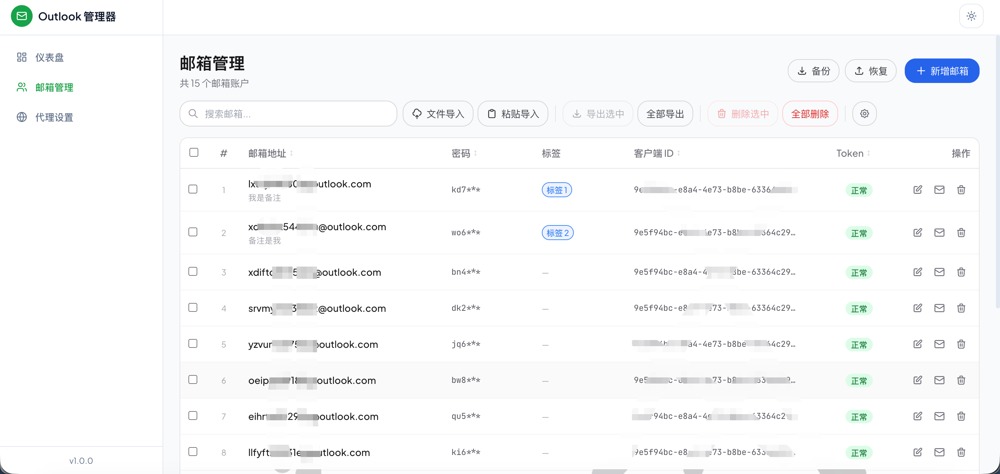
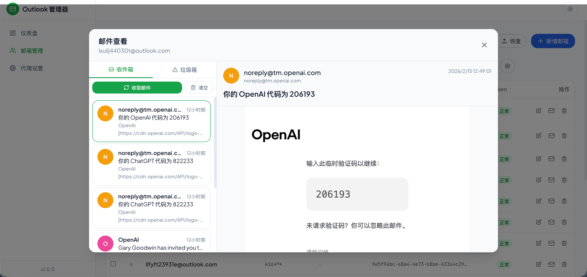
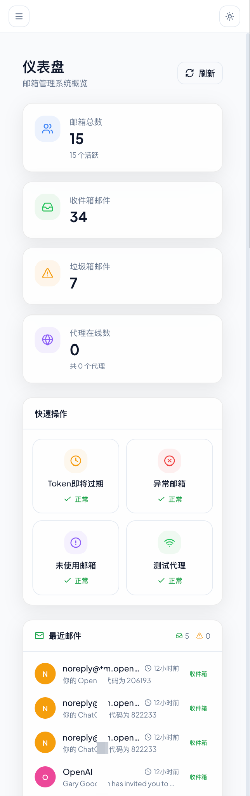

# Outlook 邮箱管理器

一个用于批量管理 Microsoft Outlook 邮箱账户的全栈 Web 应用。支持 OAuth2 双协议（Graph API + IMAP）收取邮件，内置代理管理，提供现代化的 Glassmorphism 风格界面。

## 界面预览

| 仪表盘 | 邮箱管理 |
|:---:|:---:|
|  |  |

| 邮件查看 | 移动端 |
|:---:|:---:|
|  |  |

## 技术栈

| 层级 | 技术 |
|------|------|
| 后端 | Koa 3 + TypeScript + SQLite (better-sqlite3) |
| 前端 | React 19 + Tailwind CSS 3 + Zustand 5 + Framer Motion 11 |
| UI 组件 | Radix UI 原语 + 自定义 Glassmorphism 组件 |
| 邮件协议 | Microsoft Graph API / IMAP (XOAUTH2) |
| 代理 | SOCKS5 (socks-proxy-agent) / HTTP (undici ProxyAgent) |

## 功能概览

- **仪表盘** — 账户统计、最近邮件、快捷操作
- **账户管理** — 批量导入/导出、搜索、分页、多选操作、列排序与显隐
- **标签系统** — 创建/编辑/删除标签，为账户分配标签，右键快速切换
- **邮件查看** — 三栏布局（账户列表 → 邮件列表 → 邮件正文），支持收件箱/垃圾邮件切换
- **代理设置** — SOCKS5/HTTP 代理管理、连通性测试、默认代理设置
- **双协议收信** — Graph API 优先，IMAP 自动降级，本地缓存兜底
- **访问密码** — 可选的访问密码保护，SHA256 Token 认证
- **数据备份** — 一键备份/恢复 SQLite 数据库
- **导入去重** — 两步导入流程（预览 → 确认），支持跳过/覆盖重复项
- **深色/浅色主题** — 跟随系统或手动切换
- **响应式布局** — 移动端适配，侧边栏抽屉模式

## 项目结构

```
outlook-mail-manager/
├── server/                  # 后端服务
│   └── src/
│       ├── config/          # 环境配置
│       ├── controllers/     # 请求处理器
│       ├── database/        # SQLite 连接 & 迁移
│       ├── middlewares/      # 日志 & 错误处理
│       ├── models/          # 数据访问层
│       ├── routes/          # API 路由
│       ├── services/        # 业务逻辑（OAuth、Graph、IMAP、代理）
│       ├── types/           # TypeScript 类型定义
│       └── utils/           # 工具函数
├── web/                     # 前端应用
│   └── src/
│       ├── components/      # UI 组件（按模块分组）
│       ├── lib/             # API 客户端 & 工具函数
│       ├── pages/           # 页面组件
│       ├── stores/          # Zustand 状态管理
│       └── types/           # 前端类型定义
├── .env.example             # 环境变量模板
└── package.json             # 根 monorepo 配置
```

## 快速开始

### 环境要求

- Node.js >= 18
- npm >= 9

### 安装

```bash
# 克隆项目后，一键安装所有依赖
npm run install:all
```

### 配置

复制环境变量模板并按需修改：

```bash
cp .env.example .env
```

| 变量 | 默认值 | 说明 |
|------|--------|------|
| `PORT` | `3000` | 服务端口 |
| `LOG_LEVEL` | `info` | 日志级别 |
| `DB_PATH` | `./data/outlook.db` | SQLite 数据库路径（相对于 server/） |
| `ACCESS_PASSWORD` | _(空)_ | 访问密码，留空则不启用认证 |

### 开发模式

```bash
# 同时启动前后端（热重载）
npm run dev
```

- 前端：http://localhost:5173（Vite dev server，自动代理 `/api` 到后端）
- 后端：http://localhost:3000

### 生产构建

```bash
# 构建前端
npm run build

# 启动后端（同时托管前端静态文件）
npm start
```

访问 http://localhost:3000 即可使用。

## API 端点

### 账户 `/api/accounts`

| 方法 | 路径 | 说明 |
|------|------|------|
| GET | `/` | 获取账户列表（支持分页、搜索） |
| GET | `/:id` | 获取单个账户 |
| POST | `/` | 创建账户 |
| PUT | `/:id` | 更新账户 |
| DELETE | `/:id` | 删除账户 |
| POST | `/batch-delete` | 批量删除 |
| POST | `/import` | 批量导入 |
| GET | `/export/all` | 导出全部 |

### 邮件 `/api/mails`

| 方法 | 路径 | 说明 |
|------|------|------|
| POST | `/fetch` | 拉取邮件（Graph API → IMAP 降级） |
| POST | `/fetch-new` | 仅拉取新邮件 |
| GET | `/cached/:accountId` | 获取缓存邮件 |
| DELETE | `/clear/:accountId` | 清除缓存 |

### 代理 `/api/proxies`

| 方法 | 路径 | 说明 |
|------|------|------|
| GET | `/` | 获取代理列表 |
| POST | `/` | 创建代理 |
| PUT | `/:id` | 更新代理 |
| DELETE | `/:id` | 删除代理 |
| POST | `/:id/test` | 测试连通性 |
| PUT | `/:id/set-default` | 设为默认 |

### 仪表盘 `/api/dashboard`

| 方法 | 路径 | 说明 |
|------|------|------|
| GET | `/stats` | 获取统计数据 |

## 账户导入格式

支持文本批量导入，每行一个账户，字段用分隔符分隔：

```
邮箱----密码----客户端ID----刷新令牌
```

分隔符可自定义（默认 `----`）。

## 致谢

本项目的 OAuth2 认证流程参考了 [MS_OAuth2API_Next](https://github.com/HChaoHui/MS_OAuth2API_Next)，感谢原作者 [@HChaoHui](https://github.com/HChaoHui) 的开源贡献。

## License

MIT
